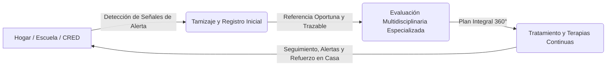
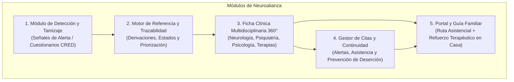

# 🧠 Neuroalianza: Ruta Multidisciplinaria para Conectar Salud, Familia y Neurodesarrollo

> **Hackatón Instituto Nacional de Salud del Niño San Borja (INSN SB) 2026**  
> *Servicios involucrados: Neurología Pediátrica · Psiquiatría Infantil · Psicología · Genética · Medicina Física y Rehabilitación*

---

## 📌 1. Visión y Resumen Ejecutivo

**Neuroalianza** es una plataforma digital de articulación clínica y acompañamiento familiar diseñada para transformar la ruta de atención de niños y adolescentes con sospecha o diagnóstico de **trastornos del neurodesarrollo** (Trastorno del Espectro Autista - TEA, TDAH, trastornos de la comunicación/lenguaje, retraso global del desarrollo y discapacidad intelectual).

El sistema conecta el **primer nivel de atención** (control CRED, postas y centros de salud comunitarios) con los **centros de atención altamente especializada** (como el INSN San Borja) y el **entorno familiar/escolar**, asegurando la detección oportuna durante la ventana crítica de desarrollo (0 a 5 años), facilitando referencias eficientes, coordinando el trabajo del equipo multidisciplinario y reduciendo el abandono del tratamiento terapéutico.



---

## 📚 2. Hub de Documentación del Proyecto

El repositorio cuenta con documentación técnica profunda y exhaustiva para cada área del sistema:

### 🐍 Documentación del Backend (Python 3.12+ / FastAPI / Hexagonal)
* 📖 **[Backend README](file:///home/techatlasdev/Proyectos/Sensoria/hackatones/neuroalianza-v1/backend/README.md):** Visión general del servicio backend, inicio rápido con `uv` y comandos clave.
* 🏛️ **[Filosofía y Principios](file:///home/techatlasdev/Proyectos/Sensoria/hackatones/neuroalianza-v1/backend/PHILOSOPHY.md):** Postura ético-clínica, minimización de datos, inmutabilidad del timeline y funciones puras.
* 🤝 **[Guía de Contribución](file:///home/techatlasdev/Proyectos/Sensoria/hackatones/neuroalianza-v1/backend/CONTRIBUTING.md):** Flujo Git, contratos de arquitectura (`import-linter`), estándares Ruff/MyPy y testing obligatorio.
* 📐 **[Arquitectura Técnica](file:///home/techatlasdev/Proyectos/Sensoria/hackatones/neuroalianza-v1/backend/docs/ARCHITECTURE.md):** Puertos y adaptadores, Composition Root, bus de eventos y RFC 7807.
* 🧠 **[Dominio y Estados](file:///home/techatlasdev/Proyectos/Sensoria/hackatones/neuroalianza-v1/backend/docs/DOMAIN_AND_STATE_MACHINE.md):** Máquina de estados determinista, motor de tamizaje (EEDP/TEPSI/M-CHAT) y alertas.
* 🌐 **[Contratos de la API](file:///home/techatlasdev/Proyectos/Sensoria/hackatones/neuroalianza-v1/backend/docs/API_CONTRACTS.md):** Catálogo de endpoints por actor, idempotencia y proyecciones de vista.
* 🧪 **[Estrategia de Testing](file:///home/techatlasdev/Proyectos/Sensoria/hackatones/neuroalianza-v1/backend/docs/TESTING_STRATEGY.md):** Pirámide de 5 niveles, Hypothesis, SimulatedClock y Schemathesis.
* 🛠️ **[Herramientas y Estándares](file:///home/techatlasdev/Proyectos/Sensoria/hackatones/neuroalianza-v1/backend/docs/TOOLING_AND_STANDARDS.md):** Configuración de `uv`, Ruff (`ALL`), MyPy (`strict`) y Makefile.

### ⚛️ Documentación del Frontend (React 19 / TypeScript / shadcn/ui / PWA Mobile-First)
* 📖 **[Frontend README](file:///home/techatlasdev/Proyectos/Sensoria/hackatones/neuroalianza-v1/frontend/README.md):** Visión general de la PWA Mobile-First, configuración con Vite, React 19 y características.
* 🎨 **[Filosofía y Principios UX](file:///home/techatlasdev/Proyectos/Sensoria/hackatones/neuroalianza-v1/frontend/PHILOSOPHY.md):** Enfoque humano para 3 realidades (CRED, Familias, Especialistas), PWA Mobile-First, shadcn/ui y accesibilidad.
* 🤝 **[Guía de Contribución](file:///home/techatlasdev/Proyectos/Sensoria/hackatones/neuroalianza-v1/frontend/CONTRIBUTING.md):** Procedimiento de componentes shadcn/ui (`npx shadcn@latest add`), tokens semánticos, tipografía $\ge 16\text{px}$ y PRs.
* 🤖 **[Reglas para Asistentes AI](file:///home/techatlasdev/Proyectos/Sensoria/hackatones/neuroalianza-v1/frontend/agents.md):** Reglas normativas directas: `MobileAppShell`, tokens semánticos, iconografía `lucide-react` y prohibiciones estrictas.
* 🏛️ **[Arquitectura de Interfaz](file:///home/techatlasdev/Proyectos/Sensoria/hackatones/neuroalianza-v1/frontend/docs/ARCHITECTURE.md):** Layout `MobileAppShell`, enrutado por zonas, React Query y sincronización offline.
* 📋 **[Estándares Normativos](file:///home/techatlasdev/Proyectos/Sensoria/hackatones/neuroalianza-v1/frontend/docs/neuro_estandares.md):** Especificación normativa completa sobre tokens shadcn, linters, `MobileAppShell` y buenas prácticas.
* 🗺️ **[Mapa de Rutas y Páginas](file:///home/techatlasdev/Proyectos/Sensoria/hackatones/neuroalianza-v1/frontend/docs/routes.md):** Especificación funcional de las 23 pantallas priorizadas por `[P1]` y `[P2]`.
* 🌈 **[Sistema de Diseño y Tokens](file:///home/techatlasdev/Proyectos/Sensoria/hackatones/neuroalianza-v1/frontend/docs/DESIGN_SYSTEM_AND_TOKENS.md):** Variables CSS de shadcn/ui, escala tipográfica, áreas táctiles $\ge 44\text{px}$ y WCAG AAA.
* 🧪 **[Estrategia de Testing](file:///home/techatlasdev/Proyectos/Sensoria/hackatones/neuroalianza-v1/frontend/docs/TESTING_STRATEGY.md):** Pirámide de pruebas con Vitest, Testing Library, auditoría axe y MSW.

---

## 🎯 3. Objetivos del Proyecto

### 🎯 Objetivo General
Desarrollar una solución tecnológica accesible, integral e interoperable que optimice la ruta asistencial de pacientes con trastornos del neurodesarrollo en el Perú, agilizando la detección temprana, reduciendo las barreras geográficas y socioeconómicas en el proceso de referencia, y maximizando la adherencia terapéutica mediante la articulación del equipo multidisciplinario y el empoderamiento familiar.

### 📋 Objetivos Específicos
1. **Estandarizar y digitalizar la detección temprana:** Proveer instrumentos de tamizaje clínico y de observación sencillos para el personal de CRED, primer nivel de atención, escuelas y cuidadores.
2. **Garantizar la trazabilidad de referencias:** Proporcionar un sistema de seguimiento en tiempo real del estado de cada paciente en la red asistencial, eliminando pérdidas de información y trámites desarticulados.
3. **Unificar la visión clínica (Ficha Multidisciplinaria 360°):** Centralizar las evaluaciones, diagnósticos funcionales y planes de intervención de neuropediatría, psicología, psiquiatría, genética y las diferentes terapias (lenguaje, ocupacional, física).
4. **Prevenir el abandono y las inasistencias terapéuticas:** Implementar sistemas proactivos de alertas, recordatorios adaptados a canales comunitarios y seguimiento de citas para familias con dificultades de traslado.
5. **Acompañar y capacitar a las familias:** Proporcionar un portal informativo con lenguaje comprensible, visualización clara del próximo paso en la ruta de atención y guías de refuerzo terapéutico aplicables en el hogar.

---

## 📊 4. Contexto y Justificación del Problema (Realidad Nacional)

En el Perú, el abordaje de los trastornos del neurodesarrollo enfrenta brechas críticas documentadas por el Ministerio de Salud (MINSA) y el INSN San Borja:

* **Alta y Creciente Demanda Asistencial:**
  * En 2025, los establecimientos del MINSA atendieron **96,512 casos de TEA** (79.3% en población infantil).
  * Entre enero y junio de 2025, se registraron **25,010 atenciones por TDAH** (80% en niños).
* **Diagnóstico Tardío y Pérdida de la Ventana de Oportunidad:**
  * En hospitales de referencia peruanos, el **85.4% de niños menores de 5 años evaluados por otros motivos presentó alteraciones no detectadas previamente** en una o más áreas del desarrollo.
  * Muchos pacientes de regiones llegan a centros de referencia entre los **2 y 5 años** con alteraciones ya consolidadas.
* **Brecha Estructural de Especialistas:**
  * Mientras la OMS establece un mínimo de 23 profesionales por cada 10,000 habitantes para servicios básicos, en el Perú existen solo **~42 médicos especialistas por cada 100,000 habitantes**, con una fuerte concentración en Lima Metropolitana.
* **Carga para las Familias e Inasistencias:**
  * Una evaluación neuropsicológica estándar toma entre **4 y 7 sesiones**, generando altos costos de traslado, hospedaje y desgaste emocional en familias de provincias.
  * La falta de articulación entre niveles asistenciales produce que **obtener un diagnóstico no garantice la continuidad del tratamiento**.

---

## 👥 5. Usuarios y Beneficiarios

| Rol / Actor | Necesidades y Dolores Principales | Aporte de Neuroalianza |
| :--- | :--- | :--- |
| **👶 Niños y Adolescentes** | Detección a tiempo, intervención continua sin interrupciones y estimulación adaptada. | Acceso temprano a terapias que potencian su desarrollo e inclusión. |
| **👨‍👩‍👧 Familias y Cuidadores** | Incertidumbre sobre el siguiente paso, pérdida de citas, falta de orientación sobre terapias en casa. | Hoja de ruta clara, recordatorios, materiales educativos y actividades guiadas para el hogar. |
| **🩺 Personal de 1er Nivel / CRED** | Falta de herramientas rápidas de tamizaje y protocolos claros para referenciar a tiempo. | Cuestionarios estandarizados, semaforización de riesgo y derivación directa. |
| **👨‍⚕️ Equipo Especializado Multidisciplinario** | Historias clínicas fragmentadas; cada especialista ve solo una parte del paciente. | Ficha consolidada 360°, evolución transversal compartida y metas terapéuticas comunes. |

---

## 🧩 6. Módulos y Arquitectura Funcional



### 1. Módulo de Detección y Orientación Inicial
* Cuestionarios de detección rápida estructurados por grupos de edad (hitos motores, lenguaje, interacción social, conducta).
* Matriz de semaforización de riesgo (Verde: Desarrollo esperado, Amarillo: Observación/Monitoreo, Rojo: Alerta de Neurodesarrollo / Requiere Referencia).
* Guía de orientación inmediata para el personal de salud y la familia tras el tamizaje.

### 2. Sistema de Referencia y Trazabilidad Asistencial
* Registro de solicitud de referencia con anexado de señales de alerta y antecedentes.
* Tablero de control de estados: `Detección Inicial` $\rightarrow$ `Referencia Enviada` $\rightarrow$ `Evaluación Multidisciplinaria` $\rightarrow$ `Plan Terapéutico Activo` $\rightarrow$ `Seguimiento Ambulatorio / Comunitario`.
* Notificaciones de recepción y priorización clínica para optimizar los tiempos de espera.

### 3. Ficha Multidisciplinaria Consolidada (Visión 360°)
* Espacio unificado donde convergen las evaluaciones de:
  * Neurología Pediátrica y Genética
  * Psiquiatría Infantil
  * Psicología y Neuropsicología
  * Terapia de Lenguaje, Terapia Ocupacional y Terapia Física
* Registro de objetivos terapéuticos compartidos y evolución periódica.

### 4. Seguimiento de Citas, Asistencia y Adherencia Terapéutica
* Calendario interactivo de sesiones multidisciplinarias.
* Sistema de alertas tempranas ante ausencias consecutivas para activar soporte social.
* Mecanismos de seguimiento a distancia para familias que retornan a sus regiones de origen.

### 5. Portal de Acompañamiento y Refuerzo Familiar
* Vista clara en lenguaje sencillo del estado actual y los próximos pasos del paciente.
* Repositorio de pautas y ejercicios de estimulación terapéutica en casa (videos, infografías, fichas descargables).
* Directorio de servicios y contactos de apoyo institucional.

---

## ⚖️ 7. Alcance y Restricciones Éticas / Clínicas

### ✅ Qué SÍ incluye la solución
* Prototipo digital funcional e interactivo de la ruta completa de atención.
* Detección temprana orientativa basada en escalas clínicas reconocidas.
* Gestión de referencias, trazabilidad de expedientes y agenda terapéutica multidisciplinaria.
* Enfoque centrado en el usuario, diseñado para usabilidad móvil y adaptabilidad a redes de baja conectividad.

### 🚫 Qué NO incluye (Delimitaciones)
* **No realiza diagnóstico automatizado:** La solución es un soporte y organizador de la ruta asistencial; el diagnóstico formal y las prescripciones son potestad exclusiva de los profesionales de salud.
* **No reemplaza el criterio médico ni el juicio clínico:** Brinda alertas orientativas sin sustituir la evaluación presencial o teleasistida.
* **No requiere hardware costoso ni equipamiento especializado:** Totalmente accesible mediante navegadores web y dispositivos estándar.

---

## 🛠️ 8. Stack Tecnológico

* **Frontend:**
  * **Framework:** React 19 + TypeScript
  * **Build Tool:** Vite 8 con soporte de React Compiler
  * **Sistema de Diseño:** Untitled UI React (React Aria Components) + Tailwind CSS
  * **Gestión de Estado:** TanStack React Query
* **Backend:**
  * **Lenguaje:** Python 3.12+
  * **Gestor de Entornos y Paquetes:** `uv` (rápido, determinista y moderno)
  * **Framework:** FastAPI (REST API estructurada con Pydantic v2)
  * **Arquitectura:** Hexagonal / Puertos y Adaptadores con DDD
  * **Testing & Calidad:** Pytest, HTTPX TestClient, Hypothesis, Schemathesis, Ruff, MyPy
* **Base de Datos & Persistencia:**
  * Adaptador en memoria para desarrollo y demo; PostgreSQL para producción.

---

## 🧪 9. Estrategia de Testing y Calidad

En cumplimiento con los estándares de desarrollo, **cada funcionalidad e integración cuenta con pruebas automatizadas**:

1. **Backend Tests:**
   * Pruebas unitarias de lógica de negocio (algoritmos de semaforización de riesgo, validaciones de edad vs hitos).
   * Pruebas de integración de endpoints API (creación de pacientes, flujo de referencias, notas multidisciplinarias).
   * Ejecución ágil con `uv run pytest`.
2. **Frontend Tests:**
   * Pruebas de componentes y flujos de usuario (tamizaje interactivo, navegación de roles, visualización de trazabilidad).
   * Pruebas de accesibilidad automatizadas con `axe-core`.

---

## 🚀 10. Guía de Ejecución Local

### Prerrequisitos
* Python `>=3.12` y gestor [`uv`](https://docs.astral.sh/uv/)
* Node.js `>=20`
* Gestor de paquetes `npm` o `pnpm`

### Configuración del Backend (con `uv`)
```bash
cd backend

# Sincronizar e instalar dependencias
uv sync

# Ejecutar el servidor de desarrollo
uv run fastapi dev main.py

# Ejecutar pruebas automatizadas
uv run pytest
```

### Configuración del Frontend
```bash
cd frontend
npm install
npm run dev  # Servidor de desarrollo Vite en http://localhost:5173
```

---

## 📄 11. Licencia y Créditos
Proyecto desarrollado en el marco de la **Hackatón INSN San Borja 2026: Conectando Ideas para Innovar en la Salud Infantil**, alineado a las necesidades de los servicios de Neurología, Psiquiatría, Psicología y Genética.
