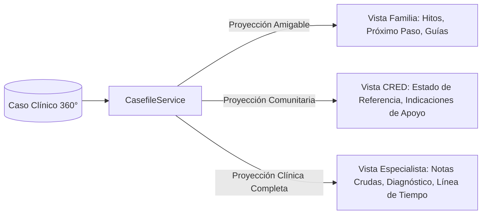

# 🌐 Especificación y Contratos de la API REST — Neuroalianza

> **Proyecto:** Neuroalianza (Hackatón INSN San Borja 2026 — Desafío 04: Neurodesarrollo)  
> **Prefijo Global:** `/api/v1`  
> **Estándar de Errores:** RFC 7807 (`application/problem+json`)  
> **Fuente de Verdad:** Contrato versionado en `contracts/openapi.json`

---

## 1. Convenciones Globales de la API

| Aspecto | Estándar / Decisión |
| :--- | :--- |
| **Estilo Arquitectónico** | REST orientado a recursos con acciones explícitas (`/transitions`, `/confirm`, `/decline`). |
| **Formato de Carga Útil** | `application/json` exclusivamente (con UTF-8). |
| **Fechas y Tiempos** | Formato **ISO 8601 en UTC** (ej. `2026-08-15T14:30:00Z`). |
| **Identificadores** | **UUID v7** (ordenables cronológicamente de forma nativa). |
| **Paginación** | **Basada en cursor** (`limit`, `cursor`, `next_cursor`). Tolerante a inserciones concurrentes y cortes de red. |
| **Idempotencia** | Cabecera `Idempotency-Key` en endpoints de escritura (`POST`, `PUT`) para reintentos seguros. |
| **Trazabilidad y Correlación** | Cabecera `X-Request-Id` recibida o autogenerada, propagada a logs y eventos de dominio. |
| **Seguridad de Entrada** | Esquemas Pydantic con `extra="forbid"` (campos no reconocidos son rechazados). |

---

## 2. Contrato de Errores RFC 7807

Toda respuesta de error HTTP $4xx$ o $5xx$ tiene la estructura estandarizada **Problem Details** (`RFC 7807`):

```json
{
  "type": "https://neuroalianza.pe/errors/invalid-transition",
  "title": "Transición de estado no permitida",
  "status": 409,
  "detail": "Un caso en estado DETECTADO no puede pasar a EN_TERAPIA.",
  "instance": "/api/v1/specialist/cases/018f3a9e-8c3b-7000-8000-000000000001/transitions",
  "request_id": "01J8K9X2M4N5P6Q7R8S9T0V1W2",
  "errors": [
    {
      "field": "target_state",
      "message": "Los estados válidos a partir de DETECTADO son: SIN_RIESGO, VIGILANCIA, DERIVADO."
    }
  ]
}
```

### 2.1 Catálogo de Tipos de Error
* `https://neuroalianza.pe/errors/not-found` ($404$): Entidad (caso, paciente, cita) no encontrada.
* `https://neuroalianza.pe/errors/invalid-transition` ($409$): Violación a la máquina de estados.
* `https://neuroalianza.pe/errors/validation-error` ($422$): Datos de entrada inválidos o campos desconocidos.
* `https://neuroalianza.pe/errors/screening-incomplete` ($400$): Respuestas incompletas para el rango etario.
* `https://neuroalianza.pe/errors/duplicate-active-case` ($409$): El paciente ya posee un caso activo.
* `https://neuroalianza.pe/errors/unauthorized-role` ($403$): El rol del usuario no tiene permisos sobre la acción.

---

## 3. Superficie Completa de Endpoints por Actor

### 3.1 Personal de Salud del Primer Nivel (CRED / Postas)

| Método | Ruta | Descripción |
| :--- | :--- | :--- |
| `GET` | `/api/v1/screening/catalog` | Obtiene el catálogo de preguntas y señales de alarma según la edad en meses (`age_months`). |
| `POST` | `/api/v1/screening/applications` | Envía las respuestas del tamizaje y obtiene el resultado de riesgo y recomendaciones. |
| `GET` | `/api/v1/screening/applications/{id}` | Consulta el resultado y detalle explicativo de un tamizaje previo. |
| `POST` | `/api/v1/referrals` | Crea una solicitud formal de referencia anexando antecedentes y señales de alerta. |
| `GET` | `/api/v1/health-worker/cases` | Lista casos originados por el establecimiento con estado de referencia y contrarreferencia. |
| `GET` | `/api/v1/health-worker/cases/{id}` | Vista resumida del caso para el personal del primer nivel. |
| `POST` | `/api/v1/health-worker/cases/{id}/notes` | Registra notas de seguimiento comunitario o visitas domiciliarias. |

---

### 3.2 Familia y Cuidadores

| Método | Ruta | Descripción |
| :--- | :--- | :--- |
| `GET` | `/api/v1/family/cases/{id}/journey` | Visualización en lenguaje amigable del recorrido asistencial y avance del caso. |
| `GET` | `/api/v1/family/cases/{id}/next-step` | Indicación clara del próximo paso inmediato (dónde acudir, qué llevar, fecha). |
| `GET` | `/api/v1/family/appointments` | Lista de citas programadas del paciente con fecha, hora, consultorio y profesional. |
| `POST` | `/api/v1/family/appointments/{id}/confirm` | Confirmación de asistencia por parte de la familia. |
| `POST` | `/api/v1/family/appointments/{id}/decline` | Registro de declinación con **motivo estructurado** (`motivo: economico, distancia, horario, salud, otro`). |
| `GET` | `/api/v1/family/care-plan/{case_id}` | Plan de estimulación terapéutica y actividades para realizar en el hogar. |
| `POST` | `/api/v1/family/care-plan/{case_id}/activities/{activity_id}/complete` | Marcado de actividad terapéutica realizada en casa. |
| `POST` | `/api/v1/family/uploads` | Subida segura de videos breves de conducta en casa o documentos adjuntos. |
| `GET` | `/api/v1/family/guidance` | Pautas y guías psicoeducativas por temática (`?topic=lenguaje`, `?topic=sensorial`). |

> [!NOTE]
> **Captura de Motivos de Declinación:**  
> El endpoint `/family/appointments/{id}/decline` alimenta el indicador de causas reales de inasistencia, demostrando empíricamente que la inasistencia no es sinónimo de falta de interés familiar.

---

### 3.3 Equipo Especializado Multidisciplinario (INSN SB)

| Método | Ruta | Descripción |
| :--- | :--- | :--- |
| `GET` | `/api/v1/specialist/cases` | Tablero de casos asignados con filtros por estado, prioridad y región de procedencia. |
| `GET` | `/api/v1/specialist/cases/{id}` | **Ficha Multidisciplinaria 360°:** Historial completo, notas cruzadas de Neurología, Psicología, Psiquiatría y Terapias. |
| `POST` | `/api/v1/specialist/cases/{id}/transitions` | Transiciona el estado del caso con actor y justificación clínica. |
| `POST` | `/api/v1/specialist/cases/{id}/notes` | Agrega nota clínica especializada (con especialidad y nivel de visibilidad). |
| `POST` | `/api/v1/specialist/cases/{id}/diagnosis` | Registra el informe de diagnóstico funcional multidisciplinario. |
| `POST` | `/api/v1/specialist/cases/{id}/care-plan` | Define y actualiza el plan terapéutico integral y metas en casa. |
| `POST` | `/api/v1/specialist/cases/{id}/counter-referral` | Emite la ficha de contrarreferencia hacia la posta de salud de origen. |
| `GET` | `/api/v1/specialist/alerts` | Bandeja de alertas activas (casos estancados, inasistencias reiteradas). |
| `POST` | `/api/v1/specialist/appointments` | Programa citas individuales de evaluación, terapia o control. |
| `POST` | `/api/v1/specialist/appointments/plan-evaluation-block` | Ejecuta la heurística de agrupación para concentrar sesiones de evaluación en mínimos días. |
| `GET` | `/api/v1/specialist/metrics` | Métricas analíticas de tiempos de espera, distribución territorial y deserción. |

---

### 3.4 Administración y Control de Demostración

> [!IMPORTANT]
> Estos endpoints solo se registran cuando la variable de entorno `NEURO_MODE=demo`. En modo producción (`production`), las rutas no existen.

| Método | Ruta | Descripción |
| :--- | :--- | :--- |
| `POST` | `/api/v1/admin/alerts/run` | Disparo manual instantáneo del motor de alertas para demostración en vivo. |
| `POST` | `/api/v1/admin/clock/advance` | Adelanta el reloj simulado $N$ días o semanas (viaje en el tiempo). |
| `POST` | `/api/v1/admin/clock/reset` | Restablece el reloj simulado a la fecha base de la demostración. |
| `GET` | `/api/v1/admin/notifications` | Bandeja de inspección de mensajes simulados (WhatsApp / SMS) enviados a las familias. |
| `POST` | `/api/v1/admin/seed/reset` | Reinicia la base de datos en memoria con el dataset precargado de prueba. |

---

### 3.5 Sistema y Diagnóstico

| Método | Ruta | Descripción |
| :--- | :--- | :--- |
| `GET` | `/health` | Chequeo de liveness del servicio. |
| `GET` | `/health/ready` | Chequeo de readiness (verifica adaptadores e integridad de arranque). |
| `GET` | `/api/v1/system/info` | Versión del backend, modo de ejecución y configuración de adaptadores activos. |

---

## 4. Proyección de Datos por Rol (`CasefileService`)

La información de un caso clínico se proyecta de forma diferenciada según el rol del usuario que la consulta:



* **Familia:** Oculta notas clínicas crudas o jerga médica compleja. Muestra una barra de progreso comprensible, fecha de citas y ejercicios prácticos de estimulación.
* **Personal de 1er Nivel:** Muestra si la derivación fue admitida, citas pendientes y el informe de contrarreferencia para seguimiento local.
* **Especialista:** Muestra el expediente clínico completo, historial inmutable de transiciones, alertas y notas multidisciplinarias.
