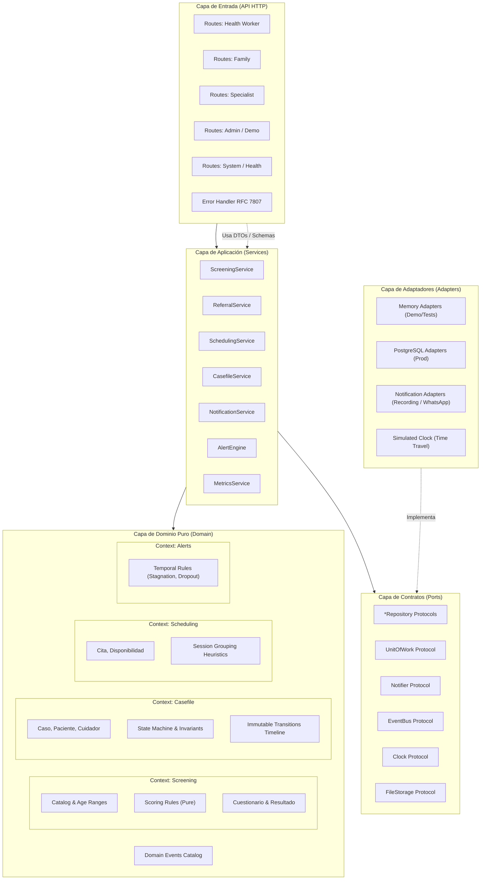

# 📐 Arquitectura Técnica del Backend — Neuroalianza

> **Proyecto:** Neuroalianza (Hackatón INSN San Borja 2026 — Desafío 04: Neurodesarrollo)  
> **Patrón:** Puertos y Adaptadores (Arquitectura Hexagonal) con Domain-Driven Design (DDD) y Comunicación Orientada a Eventos.

---

## 1. Visión General de la Arquitectura

El backend de **Neuroalianza** está diseñado como un sistema modular, desacoplado y altamente testeable. Su propósito es conectar al personal del primer nivel de atención (CRED), a las familias y al equipo multidisciplinario del centro de alta especialidad (como el INSN San Borja), garantizando la trazabilidad integral de pacientes infantiles con sospecha o diagnóstico de trastornos del neurodesarrollo.



---

## 2. Las Cuatro Capas del Sistema

### 2.1 Dominio Puro (`app/domain/`)
* **Aislamiento Total:** Cero dependencias externas (`fastapi`, `pydantic`, `sqlalchemy`, `requests` están estrictamente prohibidos). Solo `stdlib` de Python.
* **Modelos Inmutables:** Clases de datos inmutables (`dataclasses(frozen=True)`).
* **Funciones Puras:** El motor de tamizaje y la máquina de estados no producen efectos secundarios, no acceden a red ni a bases de datos; operan exclusivamente sobre las entradas provistas.
* **Separación por Contextos:** Cada subcarpeta representa un bounded context (`screening`, `casefile`, `scheduling`, `alerts`, `shared`).

### 2.2 Puertos (`app/ports/`)
* **Definición de Contratos:** Interfaces abstractas expresadas mediante `typing.Protocol`.
* **Desacoplamiento Tecnológico:** Ninguna firma de método o parámetro menciona SQL, HTTP, AWS S3 o proveedores específicos.
* **Puertos Clave:**
  * `PacienteRepository`, `CasoRepository`, `CitaRepository`, `TamizajeRepository`, `NotificacionRepository`.
  * `UnitOfWork`: Garantiza transaccionalidad atómica (ej. transición de estado + publicación de evento + encolado de notificación).
  * `Notifier`: Abstracción de canales de mensajería (WhatsApp, SMS, Email).
  * `EventBus`: Publicación y suscripción desacoplada de eventos de dominio.
  * `Clock`: Abstracción temporal (`now()`), fundamental para testing y demostraciones en vivo.
  * `FileStorage`: Almacenamiento y generación de URLs firmadas para videos caseros de tamizaje o informes adjuntos.

### 2.3 Servicios de Aplicación (`app/services/`)
* **Casos de Uso:** Cada servicio orquesta un flujo de negocio invocando modelos de dominio y puertos.
* **Sin Lógica HTTP ni SQL:** Los servicios no conocen FastAPI (`Request`, `Response`, `HTTPException`) ni librerías de persistencia concreta.
* **Emisión de Eventos:** Al completar una operación crítica, publican eventos tipados en el `EventBus`.

### 2.4 Adaptadores (`app/adapters/`)
* **Implementaciones Intercambiables:**
  * **Modo Demostración / Tests:** Adaptadores en memoria basados en diccionarios y listas concurrentes seguras, almacenamiento en memoria y `RecordingNotifier` que guarda mensajes para inspección en vivo.
  * **Modo Producción:** Adaptadores PostgreSQL con SQLAlchemy/asyncpg, colas de mensajes y proveedores de mensajería real.
* **Suites de Conformidad:** Cada puerto posee una batería de pruebas estándar que todo adaptador debe aprobar para asegurar la sustituibilidad de Liskov.

### 2.5 Capa de Entrada HTTP (`app/api/`)
* **FastAPI:** Declaración explícita de rutas agrupadas por actor del sistema (`health-worker`, `family`, `specialist`, `admin`, `system`).
* **Esquemas Pydantic v2:** DTOs de entrada y salida desacoplados de las entidades del dominio con `extra="forbid"`.
* **Respuestas de Error Uniformes:** Manejo centralizado de excepciones traducidas a **RFC 7807 Problem Details** (`application/problem+json`).

---

## 3. Estructura Exhaustiva del Código Fuente

```
backend/
├── app/
│   ├── main.py                      # Punto de entrada y composición de la app FastAPI
│   ├── config.py                    # Settings tipadas con Pydantic (NEURO_*)
│   ├── container.py                 # Composition Root: fábrica de dependencias e inyección
│   │
│   ├── domain/                      # NÚCLEO PURO (Cero dependencias externas)
│   │   ├── shared/
│   │   │   ├── ids.py               # Identidades tipadas: CasoId, PacienteId, CitaId, etc.
│   │   │   ├── errors.py            # Jerarquía de excepciones de dominio
│   │   │   └── result.py            # Tipo Result[T, E] para operaciones fallibles
│   │   ├── screening/
│   │   │   ├── catalog.py           # Catálogo versionado de preguntas por rango etario
│   │   │   ├── rules.py             # Algoritmo de puntuación y semaforización de riesgo
│   │   │   └── models.py            # Cuestionario, Respuesta, ResultadoTamizaje
│   │   ├── casefile/
│   │   │   ├── models.py            # Caso, Paciente, Cuidador, Derivacion, NotaClinica
│   │   │   ├── states.py            # Máquina de estados (Enum de estados y transiciones)
│   │   │   └── timeline.py          # Historial inmutable de transiciones de estado
│   │   ├── scheduling/
│   │   │   ├── models.py            # Cita, Disponibilidad, BloqueDeSesiones
│   │   │   └── rules.py             # Heurística de concentración de sesiones y choques
│   │   ├── alerts/
│   │   │   └── rules.py             # Reglas temporales de alerta (estancamiento, inasistencias)
│   │   └── events.py                # Catálogo de eventos de dominio
│   │
│   ├── ports/                       # CONTRATOS ABSTRACTOS (typing.Protocol)
│   │   ├── repositories.py          # Protocolos de repositorios por agregado
│   │   ├── notifier.py              # Protocolo de envío de notificaciones
│   │   ├── event_bus.py             # Protocolo de bus de eventos (pub/sub)
│   │   ├── clock.py                 # Protocolo de reloj del sistema
│   │   ├── file_storage.py          # Protocolo de almacenamiento binario
│   │   └── unit_of_work.py          # Protocolo de transacción y atomicidad
│   │
│   ├── adapters/                    # IMPLEMENTACIONES CONCRETAS
│   │   ├── memory/                  # Adaptadores en memoria (Default / Prototipo)
│   │   │   ├── repositories.py
│   │   │   ├── unit_of_work.py
│   │   │   ├── notifier.py
│   │   │   ├── event_bus.py
│   │   │   ├── clock.py
│   │   │   └── file_storage.py
│   │   ├── postgres/                # Adaptadores para producción con PostgreSQL
│   │   ├── messaging/               # Adaptadores para WhatsApp Business / SMS
│   │   └── storage/                 # Adaptadores para S3 / MinIO
│   │
│   ├── services/                    # CASOS DE USO (Orquestan Dominio y Puertos)
│   │   ├── screening_service.py     # Aplicar cuestionarios, persistir y derivar
│   │   ├── referral_service.py      # Generación y trazabilidad de derivaciones
│   │   ├── scheduling_service.py    # Agendamiento inteligente y agrupación de citas
│   │   ├── casefile_service.py      # Visión 360° proyectada según rol del usuario
│   │   ├── notification_service.py  # Renderizado de plantillas y despacho
│   │   ├── alert_engine.py          # Motor evaluador de reglas temporales
│   │   └── metrics_service.py       # Cálculo analítico de tiempos sobre el timeline
│   │
│   ├── api/                         # CAPA DE EXPOSICIÓN HTTP
│   │   ├── deps.py                  # Inyección de dependencias de FastAPI
│   │   ├── errors.py                # Exception handlers RFC 7807
│   │   ├── schemas/                 # Modelos Pydantic v2 (Request / Response)
│   │   │   ├── common.py            # Paginación, metadatos, RFC 7807 schema
│   │   │   ├── screening.py
│   │   │   ├── casefile.py
│   │   │   ├── scheduling.py
│   │   │   └── alerts.py
│   │   └── routes/
│   │       ├── health_worker.py     # Endpoints para personal de CRED / Primer nivel
│   │       ├── family.py            # Endpoints para cuidadores y familias
│   │       ├── specialist.py        # Endpoints para equipo multidisciplinario
│   │       ├── admin.py             # Endpoints para control de demo, reloj y alertas
│   │       └── system.py            # Health check, readiness, info
│   │
│   └── seed/
│       └── demo_data.py             # Dataset precargado con historias clínicas realistas
│
├── contracts/
│   └── openapi.json                 # Contrato OpenAPI versionado (Single Source of Truth)
├── docs/                            # Documentación técnica profunda
├── tests/                           # Suite de pruebas automatizadas
├── pyproject.toml                   # Configuración de uv, Ruff, MyPy, Pytest, Coverage
├── Makefile                         # Comandos de orquestación y automatización local
└── .importlinter                    # Reglas formales de verificación de arquitectura
```

---

## 4. El Composition Root (`app/container.py`)

El archivo `app/container.py` es el **único lugar en todo el proyecto autorizado para importar adaptadores concretos**.

1. Lee la configuración tipada de `app/config.py`.
2. Instancia los adaptadores correspondientes según el entorno (`NEURO_REPOSITORY`, `NEURO_NOTIFIER`, `NEURO_CLOCK`, etc.).
3. Construye los servicios de aplicación inyectando los adaptadores como dependencias de puerto.
4. Entrega un contenedor inmutable a la capa API a través de `app/api/deps.py`.

```python
# Ejemplo de Composition Root (app/container.py)
class Container:
    def __init__(self, settings: Settings) -> None:
        # Selección de adaptadores según configuración
        if settings.repository == "memory":
            self.paciente_repo = InMemoryPacienteRepository()
            self.caso_repo = InMemoryCasoRepository()
            self.cita_repo = InMemoryCitaRepository()
            self.uow = InMemoryUnitOfWork(self.paciente_repo, self.caso_repo, self.cita_repo)
        else:
            self.uow = PostgresUnitOfWork(settings.database_url)

        if settings.clock == "simulated":
            self.clock = SimulatedClock()
        else:
            self.clock = SystemClock()

        self.event_bus = InMemoryEventBus()
        self.notifier = RecordingNotifier()

        # Construcción de servicios de aplicación
        self.screening_service = ScreeningService(self.uow, self.event_bus, self.clock)
        self.referral_service = ReferralService(self.uow, self.event_bus, self.clock)
        self.scheduling_service = SchedulingService(self.uow, self.event_bus, self.clock)
        self.alert_engine = AlertEngine(self.uow, self.notifier, self.clock)
        self.casefile_service = CasefileService(self.uow)
        self.metrics_service = MetricsService(self.uow, self.clock)
```

---

## 5. El Patrón de Event Bus Desacoplado

La comunicación entre los contextos del dominio se realiza exclusivamente mediante eventos tipados.

```python
@dataclass(frozen=True)
class CasoDerivado(DomainEvent):
    event_id: UUID
    occurred_at: datetime
    caso_id: CasoId
    paciente_id: PacienteId
    motivo_derivacion: str
    establecimiento_origen_id: str
    establecimiento_destino_id: str
    actor_id: UsuarioId
```

* **Flujo de Ejecución:**
  1. `ReferralService.crear_derivacion(...)` valida la transición en la máquina de estados.
  2. La transición se persiste en el `Timeline` a través del `UnitOfWork`.
  3. Se publica `CasoDerivado` en el `EventBus`.
  4. Los suscriptores reaccionan de manera asíncrona o desacoplada:
     * `NotificationService`: Genera un mensaje de confirmación para el cuidador y aviso a la central de referencias.
     * `MetricsService`: Actualiza los contadores analíticos de derivación territorial.
     * `AlertEngine`: Inicia la regla temporal para vigilar que el caso no quede estancado sin cita en los siguientes $N$ días.

---

## 6. Manejo de Errores: Estándar RFC 7807

La API no emite estructuras de error ad-hoc. Toda respuesta HTTP $4xx$ o $5xx$ cumple con el estándar RFC 7807:

```json
{
  "type": "https://neuroalianza.pe/errors/invalid-transition",
  "title": "Transición de estado no permitida",
  "status": 409,
  "detail": "Un caso en estado DETECTADO no puede transicionar directamente a EN_TERAPIA.",
  "instance": "/api/v1/specialist/cases/018f3a9e-8c3b-7000-8000-000000000001/transitions",
  "request_id": "01J8K9X2M4N5P6Q7R8S9T0V1W2",
  "errors": [
    {
      "field": "target_state",
      "message": "Los estados destinos válidos desde DETECTADO son: SIN_RIESGO, VIGILANCIA, DERIVADO."
    }
  ]
}
```

Un manejador global registrado en FastAPI (`app/api/errors.py`) captura las excepciones de dominio (`DomainError`, `EntityNotFoundError`, `InvalidStateTransitionError`, `ScreeningIncompleteError`) y las traduce automáticamente al formato RFC 7807, garantizando consistencia absoluta en el cliente frontend.
