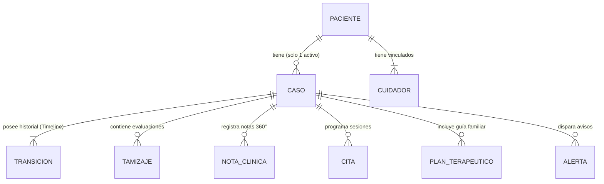
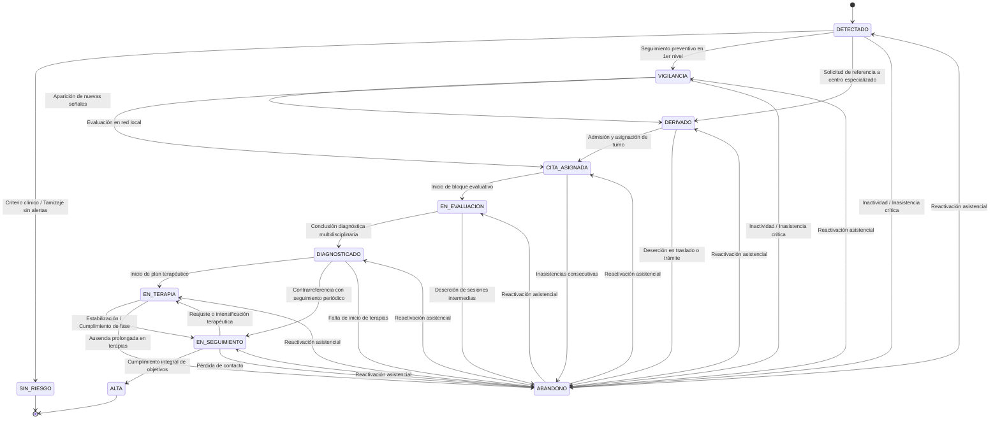

# 🧠 Modelo de Dominio y Máquina de Estados — Neuroalianza

> **Proyecto:** Neuroalianza (Hackatón INSN San Borja 2026 — Desafío 04: Neurodesarrollo)  
> **Área:** Lógica de Negocio Pura, Ciclo de Vida del Caso, Motor Clínico de Tamizaje y Reglas de Alerta.

---

## 1. Entidades y Agregados Principales

El dominio de Neuroalianza modela la trayectoria integral de atención médica y familiar de un paciente pediátrico:



### 1.1 Tipos de Identidad Diferenciados (`NewType`)
Para evitar que identificadores de distintas entidades se confundan en firmas de métodos, se emplean tipos de identidad fuertemente tipados:

```python
from typing import NewType
from uuid import UUID

PacienteId = NewType("PacienteId", UUID)
CuidadorId = NewType("CuidadorId", UUID)
CasoId = NewType("CasoId", UUID)
TamizajeId = NewType("TamizajeId", UUID)
CitaId = NewType("CitaId", UUID)
NotaId = NewType("NotaId", UUID)
UsuarioId = NewType("UsuarioId", UUID)
AlertaId = NewType("AlertaId", UUID)
```

### 1.2 Entidades Clave

| Entidad | Responsabilidad | Inmutabilidad |
| :--- | :--- | :--- |
| **`Paciente`** | Identidad mínima del niño/adolescente: `id`, `fecha_nacimiento`, `sexo`, `ubicacion` (departamento, provincia, distrito), `establecimiento_origen`. *Sin datos sensibles innecesarios.* | `@dataclass(frozen=True)` |
| **`Cuidador`** | Persona responsable: `id`, `relacion` (madre, padre, tutor), `telefono`, `canal_preferido` (WhatsApp, SMS, Llamada), `disponibilidad_horaria`. | `@dataclass(frozen=True)` |
| **`Caso`** | Agregado raíz. Agrupa al paciente con todo su recorrido: tamizajes, derivaciones, citas, evaluaciones, diagnóstico y seguimiento. | Modelo de agregado |
| **`Transicion`** | Registro inmutable de cambio de estado. Contiene: `id`, `caso_id`, `estado_origen`, `estado_destino`, `actor_id`, `motivo`, `timestamp`, `metadata`. | `@dataclass(frozen=True)` |
| **`ResultadoTamizaje`** | Resultado auditable de un cuestionario: `nivel_riesgo`, `items_activados`, `accion_recomendada`, `version_catalogo`. | `@dataclass(frozen=True)` |
| **`Cita`** | Encuentro programado: `tipo` (evaluación, terapia, control), `especialidad`, `profesional_id`, `modalidad` (presencial/teleatención), `estado`, `motivo_inasistencia`. | `@dataclass(frozen=True)` |
| **`NotaClinica`** | Registro multidisciplinario: `autor_id`, `especialidad` (Neuropediatría, Psiquiatría, Psicología, Terapia de Lenguaje, etc.), `contenido`, `visibilidad`. | `@dataclass(frozen=True)` |

---

## 2. Máquina de Estados del Caso

El ciclo de vida del caso clínico se gestiona mediante una **máquina de estados finita y determinista**.



### 2.1 Reglas y Principios de la Máquina de Estados
1. **Declaración Explícita:** Únicamente las transiciones declaradas en la tabla de transiciones permitidas son válidas. Cualquier otra es rechazada arrojando `InvalidStateTransitionError`.
2. **Actor y Motivo Obligatorios:** Toda transición exige un `actor_id` (quién ejecutó el cambio) y un `motivo` justificado.
3. **Manejo de `ABANDONO` y Reactivación:**
   * El estado `ABANDONO` es alcanzable desde cualquier estado activo ante inasistencias reiteradas o pérdida prolongada de contacto.
   * **Reactivable:** Cuando el paciente retorna al circuito de atención, el caso se reactiva retomando su estado anterior, conservando intacto el registro histórico del abandono y su causa para auditoría.
4. **Función Pura:** La función `transicionar_caso(caso, nuevo_estado, actor, motivo, clock)` es una función pura: no realiza llamadas de red ni de base de datos.

### 2.2 Invariantes del Dominio
* **Invariante 1:** Un caso siempre tiene exactamente un estado actual válido.
* **Invariante 2:** El historial de transiciones (`Timeline`) es estrictamente `append-only`.
* **Invariante 3:** La marca de tiempo de una nueva transición es monótona creciente (nunca anterior a la última transición registrada).
* **Invariante 4:** Un paciente no puede tener más de un caso activo en simultáneo.

---

## 3. Motor de Tamizaje Clínico

El motor de tamizaje es una pieza central que evalúa cuestionarios de desarrollo estandarizados en el contexto pediátrico peruano.

### 3.1 Instrumentos Clínicos Validados
El catálogo (`app/domain/screening/catalog.py`) se fundamenta en instrumentos reconocidos por el Ministerio de Salud del Perú:
* **EEDP** (Escala de Evaluación del Desarrollo Psicomotor): 0 a 24 meses.
* **TEPSI** (Test de Desarrollo Psicomotor): 2 a 5 años.
* **M-CHAT-R/F** (Modified Checklist for Autism in Toddlers, Revised with Follow-Up): 16 a 30 meses.
* **Pauta Breve de MINSA**: Tamizaje rápido en controles de Crecimiento y Desarrollo (CRED).

### 3.2 Proceso y Requisitos No Negociables
```
                 ┌─────────────────────────────┐
                 │        Entrada Pura         │
                 │  - edad_meses: int          │
                 │  - respuestas: dict[str, bool]│
                 │  - version_catalogo: str    │
                 └──────────────┬──────────────┘
                                │
                                ▼
                 ┌─────────────────────────────┐
                 │     Selección de Rango      │
                 │   y Validación Completa     │
                 └──────────────┬──────────────┘
                                │
                                ▼
                 ┌─────────────────────────────┐
                 │    Evaluación de Reglas     │
                 │  (Ítems Críticos + Puntaje) │
                 └──────────────┬──────────────┘
                                │
                                ▼
                 ┌─────────────────────────────┐
                 │         Salida Pura         │
                 │  - nivel_riesgo: BAJO/MOD/ALTO
                 │  - items_activados: list    │
                 │  - accion_recomendada: str  │
                 │  - version_aplicada: str    │
                 └─────────────────────────────┘
```

1. **Determinismo y Pureza:** Misma entrada produce siempre la misma salida. Cero I/O.
2. **Versionado Explícito:** Toda evaluación almacena la versión exacta del catálogo con la que fue procesada.
3. **Explicabilidad Total:** Cada resultado de riesgo `MODERADO` o `ALTO` detalla los ítems de alerta específicos que motivaron la calificación.
4. **Sin Etiquetas Diagnósticas:** La salida orienta la acción asistencial (*"Derivación prioritaria a Neuropediatría"*, *"Control y reevaluación en 60 días en CRED"*), sin emitir etiquetas diagnósticas automatizadas.

---

## 4. Reglas del Motor de Alertas Temporales

El `AlertEngine` evalúa periódicamente las reglas temporales contra el estado de los casos para prevenir la deserción:

| Regla | Condición Evaluada | Destinatario Notificado | Severidad |
| :--- | :--- | :--- | :--- |
| **Derivación Estancada** | Caso en `DERIVADO` por más de $N$ días sin cita asignada (default: 15 días). | Coordinación del centro especializado | `ALTA` |
| **Recordatorio de Cita** | Cita confirmada en las próximas 24h a 48h. | Cuidador primario | `MEDIA` |
| **Inasistencia Reiterada** | 2 o más citas consecutivas no asistidas. | Equipo tratante multidisciplinario | `ALTA` |
| **Riesgo de Abandono** | Sin registro de actividades o asistencia en más de $N$ semanas estando en terapia (default: 4 semanas). | Equipo tratante + Centro de origen | `CRITICA` |
| **Reevaluación Vencida** | Caso en `VIGILANCIA` con fecha programada superada. | Personal de salud del primer nivel (CRED) | `MEDIA` |
| **Evaluación Incompleta** | Bloque de evaluación iniciado sin completar en más de $N$ semanas (default: 6 semanas). | Coordinación asistencial | `ALTA` |
| **Contrarreferencia Pendiente** | Caso en `DIAGNOSTICADO` sin ficha de contrarreferencia enviada al establecimiento de origen en más de $N$ días (default: 7 días). | Especialista responsable | `MEDIA` |

### 4.1 Idempotencia y Ejecución Unificada
* **Idempotencia:** Ejecutar el motor de alertas varias veces sobre el mismo estado no duplica alertas abiertas.
* **Misma Lógica en 3 Escenarios:**
  1. Cron/Tarea en segundo plano durante la ejecución del sistema.
  2. Endpoint manual `POST /api/v1/admin/alerts/run` para demostración ante el jurado.
  3. Ejecución directa en pruebas unitarias y de integración.

---

## 5. Heurística de Agrupación de Sesiones de Evaluación

Una evaluación neuropsicológica e interdisciplinaria estándar requiere entre **4 y 7 sesiones** (Neuropediatría, Psicología, Psiquiatría, Terapia de Lenguaje, Terapia Ocupacional). Para familias que viajan desde provincias hacia Lima, esto representa un costo económico y logístico crítico.

El `SchedulingService` incorpora una heurística de optimización acotada:
1. **Entrada:** Lista de sesiones requeridas, disponibilidad horaria de especialistas y perfil de viaje familiar (ej. *"Familia proveniente de Huancavelica, estadía máxima de 3 días en Lima"*).
2. **Algoritmo de Asignación:** Busca emparejar bloques compatibles minimizando la dispersión de fechas y evitando traslapes de horarios.
3. **Resultado:** Bloque concentrado de citas en la menor cantidad de días posibles (ej. 5 sesiones agrupadas en 2 días consecutivos).
