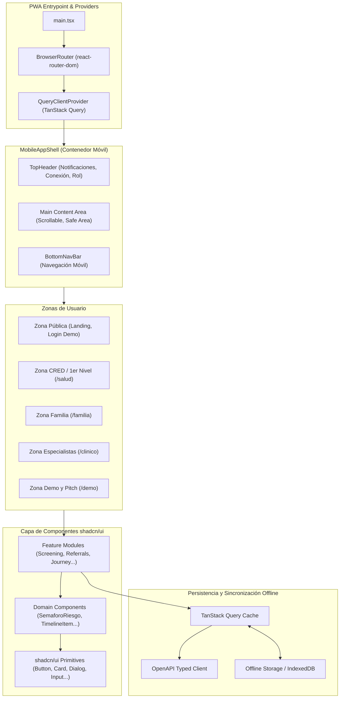

# 🏛️ Arquitectura Técnica del Frontend — Neuroalianza (PWA)

> **Proyecto:** Neuroalianza (Hackatón INSN San Borja 2026 — Desafío 04: Neurodesarrollo)  
> **Stack:** React 19, TypeScript, Vite 8, React Compiler, shadcn/ui (Radix UI), Tailwind CSS, TanStack React Query, Lucide Icons.

---

## 1. Topología de Progressive Web App (PWA) Mobile-First

El frontend de **Neuroalianza** está diseñado como una **PWA Mobile-First** para asegurar que el sistema sea accesible y ultra-usable tanto en teléfonos de familias y enfermeras en postas como en computadoras de escritorio de especialistas:



---

## 2. El Layout Global `MobileAppShell`

El componente `MobileAppShell` envuelve todas las rutas de la aplicación:

```tsx
// src/components/layout/MobileAppShell.tsx
import React from "react";
import { TopHeader } from "./TopHeader";
import { BottomNavBar } from "./BottomNavBar";

interface MobileAppShellProps {
  children: React.ReactNode;
}

export function MobileAppShell({ children }: MobileAppShellProps) {
  return (
    <div className="min-h-screen bg-muted/40 flex justify-center">
      {/* Contenedor tipo dispositivo móvil en pantallas de escritorio */}
      <div className="w-full max-w-md min-h-screen bg-background border-x border-border shadow-2xl flex flex-col relative pb-16">
        <TopHeader />
        <main className="flex-1 p-4 overflow-y-auto">
          {children}
        </main>
        <BottomNavBar />
      </div>
    </div>
  );
}
```

* **En móviles:** La aplicación ocupa el 100% del ancho con padding inferior para la barra fija.
* **En escritorio:** Se centra con un ancho máximo `max-w-md` (ej. 448px), bordes elegantes y sombra profunda, brindando una experiencia idéntica a una aplicación nativa.

---

## 3. Zonas Funcionales y Mapa de Rutas

```
src/pages/
├── public/
│   ├── LandingPage.tsx              # / -> Visión, cifras clave del neurodesarrollo y selector de rol
│   └── LoginPage.tsx                # /login -> Selector rápido de perfiles demo
├── health-worker/
│   ├── HealthWorkerDashboard.tsx    # /salud -> Pacientes CRED, tamizajes pendientes
│   ├── ScreeningWizardPage.tsx      # /salud/tamizaje/nuevo -> Asistente de tamizaje paso a paso
│   ├── ScreeningResultPage.tsx      # /salud/tamizaje/:id -> Resultado de riesgo y derivación
│   └── HealthWorkerCasesPage.tsx    # /salud/pacientes -> Lista de derivaciones de la posta
├── family/
│   ├── FamilyHomePage.tsx           # /familia -> Resumen familiar y estado del caso
│   ├── JourneyPage.tsx              # /familia/ruta -> Visualización de la Ruta de Atención
│   ├── FamilyAppointmentsPage.tsx   # /familia/citas -> Confirmación y declinación de citas
│   ├── HomeActivitiesPage.tsx       # /familia/actividades -> Guías terapéuticas en el hogar
│   └── VideoUploadPage.tsx          # /familia/video -> Envío de grabaciones breves caseras
├── specialist/
│   ├── SpecialistDashboard.tsx      # /clinico -> Bandeja de alertas y referencias
│   ├── IncomingReferralsPage.tsx    # /clinico/referencias -> Admisión de casos
│   ├── ConsolidatedCasePage.tsx     # /clinico/casos/:id -> Ficha Multidisciplinaria 360°
│   ├── SpecialistSchedulePage.tsx   # /clinico/agenda -> Calendario y bloques agrupados
│   ├── EvaluationWizardPage.tsx     # /clinico/casos/:id/evaluacion -> Registro evaluativo
│   └── ClinicalMetricsPage.tsx      # /clinico/metricas -> Métricas de tiempos y deserción
└── demo/
    └── DemoControlPanelPage.tsx     # /demo -> Simulación del reloj y disparo de alertas
```

---

## 4. Capa de Componentes shadcn/ui y Primitivas Radix

La arquitectura de interfaz desacopla los componentes en 3 niveles claros:

1. **`src/components/ui/` (Primitivas shadcn):** Componentes atómicos instalados vía CLI (`Button`, `Card`, `Dialog`, `Input`, `Select`, `Tabs`, `Badge`, `Progress`, `RadioGroup`).
2. **`src/components/shared/` (Dominio Clínico):** Componentes transversales compuestos (`SemaforoRiesgo`, `TimelineItem`, `CaseCard`, `AlertaBadge`).
3. **`src/features/*/components/` (Flujos de Negocio):** Formularios complejos y asistentes (`ScreeningWizard`, `ReferralForm`, `DeclineAppointmentModal`).

---

## 5. Resiliencia Offline y Caché con TanStack React Query

1. **Gestión de Estado del Servidor:** React Query administra la memoria caché, estados de carga (`isLoading`), revalidaciones automáticas y mutaciones con actualización optimista.
2. **Cola de Tamizaje Offline:** Para personal en postas remotas sin conectividad:
   * Los tamizajes se almacenan en `IndexedDB`/`LocalStorage`.
   * La cabecera `TopHeader` muestra un icono de sincronización con el conteo de registros locales.
   * Al reconectarse a internet, la aplicación despacha automáticamente las peticiones con cabecera `Idempotency-Key` única.
