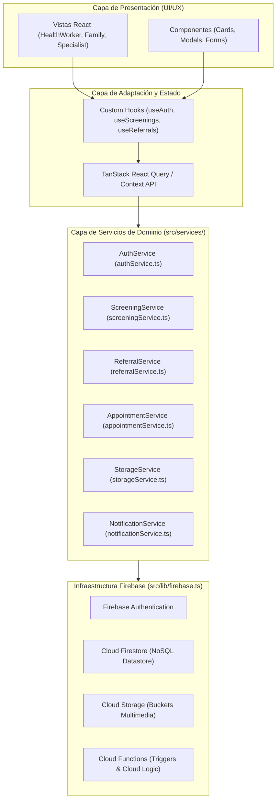

# ☁️ Arquitectura de Servicios y Backend Escalable con Firebase — Neuroalianza

> **Proyecto:** Neuroalianza (Hackatón INSN San Borja 2026 — Desafío 04: Neurodesarrollo)  
> **Backend Serverless:** Firebase Suite (Firebase Authentication, Cloud Firestore, Cloud Storage / Buckets, Cloud Functions & Security Rules)  
> **Patrón Arquitectural:** Service-Layer Pattern (Desacoplamiento Estricto UI/Servicios) + Offline-First Architecture

---

## 1. Visión y Principios Rectores

Para garantizar una solución altamente escalable, mantenible y lista para producción en el sector salud (cumpliendo estándares de privacidad y disponibilidad nacional), la plataforma **Neuroalianza** adopta **Firebase** como su infraestructura backend serverless integrada.

### ⚠️ Regla de Oro Arquitectural: Desacoplamiento Estricto
1. **CERO Lógica de Firebase en Componentes UI:** Ningún componente React (`Page`, `Component`, `Modal`, etc.) importará directamente SDKs de Firebase (`getFirestore`, `collection`, `signInWithEmailAndPassword`, `ref`, etc.) ni interactuará directamente con colecciones o buckets.
2. **Capa de Servicios Tipados (`src/services/`):** Toda interacción con la nube se encapsula en servicios modulares independientes y reutilizables con contratos TypeScript estrictos.
3. **Consumo a través de Hooks / Context (`src/hooks/` o `src/context/`):** Los componentes de interfaz consumen únicamente funciones, hooks reactivos (`useCase`, `useAuth`, `useAppointments`) o estados manejados por TanStack React Query.
4. **Mocking & Testabilidad:** Al tener contratos de servicios limpios, la suite de testing (Vitest + Testing Library) puede mockear fácilmente la capa de servicios sin requerir emuladores en vivo para pruebas unitarias.



---

## 2. Suite de Servicios Firebase en Neuroalianza

La arquitectura se apoya en los siguientes pilares de la suite de Firebase:

| Servicio | Propósito en Neuroalianza | Entidades / Casos de Uso |
| :--- | :--- | :--- |
| **Firebase Authentication** | Autenticación basada en roles y tokens seguros (JWT / Custom Claims). | Personal CRED de posta, familias (cuidadores), especialistas del INSN SB. Soporte de login telefónico/SMS para familias rurales y DNI/Credenciales para personal de salud. |
| **Cloud Firestore** | Base de datos documental NoSQL reactiva en tiempo real y offline-first. | `patients`, `screenings`, `referrals`, `appointments`, `care_roadmaps`, `clinical_notes`, `metrics`. |
| **Firebase Cloud Storage (Buckets)** | Almacenamiento seguro de archivos binarios y multimedia con URLs firmadas. | Videos caseros breves de interacción familiar (conductas de alerta), fichas CRED digitalizadas, reportes PDF de referencia. |
| **Cloud Functions (Node.js/TS)** | Lógica de negocio sensible en servidor, triggers reactivos y notificaciones. | Generación de códigos únicos de referencia (`REF-2026-XXXX`), cálculo de scores estandarizados M-CHAT-R/F, alertas SMS/WhatsApp a familias ante inasistencias y sincronización con sistemas RIS/MINSA. |
| **Firestore Security Rules** | Reglas granulares de seguridad y control de acceso RBAC. | Garantizar que un cuidador solo acceda al historial de su propio hijo/a, y que un especialista acceda a casos derivados formalmente. |

---

## 3. Modelo de Datos Documental (Cloud Firestore)

Firestore se organiza mediante colecciones de primer nivel y subcolecciones estructuradas:

```
firestore-root/
├── users/                          # Perfiles de usuario y roles
│   └── {userId}/
│       ├── role: "health_worker" | "family" | "specialist" | "admin"
│       ├── fullName: string
│       ├── establishmentId: string (ej. "Posta San Jerónimo")
│       └── phone: string
│
├── patients/                       # Ficha única del infante
│   └── {patientId}/
│       ├── dni: string
│       ├── fullName: string
│       ├── birthDate: timestamp
│       ├── ageMonths: number
│       ├── guardian: { name: string, phone: string, relationship: string }
│       ├── originEstablishment: string
│       ├── createdAt: timestamp
│       └── updatedAt: timestamp
│
├── screenings/                     # Tamizajes CRED (M-CHAT-R/F)
│   └── {screeningId}/
│       ├── patientId: string (ref -> patients)
│       ├── evaluatorId: string (ref -> users)
│       ├── instrument: "mchat_rf"
│       ├── answers: Array<{ questionId: string, answer: boolean }>
│       ├── totalFailures: number
│       ├── riskLevel: "bajo" | "medio" | "alto"
│       ├── clinicalFindings: string[]
│       └── evaluatedAt: timestamp
│
├── referrals/                      # Derivaciones hacia INSN San Borja
│   └── {referralId}/
│       ├── referralCode: string (ej. "REF-2026-8941")
│       ├── patientId: string (ref -> patients)
│       ├── screeningId: string (ref -> screenings)
│       ├── status: "emitida" | "admitida" | "en_evaluacion" | "completada"
│       ├── priority: "ALTA" | "MEDIA" | "BAJA"
│       ├── targetFacility: "INSN San Borja"
│       ├── assignedSpecialty: "Neuropediatría"
│       └── emittedAt: timestamp
│
├── appointments/                   # Citas y hoja de ruta clínica
│   └── {appointmentId}/
│       ├── referralId: string (ref -> referrals)
│       ├── patientId: string (ref -> patients)
│       ├── specialty: "Neuropediatría" | "Psicología Infantil" | "Terapia de Lenguaje"
│       ├── date: timestamp
│       ├── location: string
│       ├── status: "programada" | "confirmada" | "asistio" | "inasistencia"
│       └── declineReason?: { motive: string, notes: string, recordedAt: timestamp }
│
└── clinical_metrics/               # Agregaciones analíticas
    └── realtime_kpis/
        ├── medianWaitDays: number
        ├── totalScreeningsMonth: number
        ├── detectionRate: number
        └── noShowRate: number
```

---

## 4. Estructura de la Capa de Servicios (`src/services/`)

Toda la lógica de integración debe residir en la carpeta `src/services/`.

```
src/
├── lib/
│   └── firebase.ts                  # Inicialización limpia de Firebase SDK
├── types/
│   ├── patient.types.ts             # Interfaces de Paciente
│   ├── screening.types.ts           # Interfaces de Tamizaje
│   ├── referral.types.ts            # Interfaces de Derivación
│   └── appointment.types.ts         # Interfaces de Citas y Hoja de Ruta
└── services/
    ├── index.ts                     # Exportador central de servicios
    ├── auth.service.ts              # Inicio de sesión, roles y perfil
    ├── screening.service.ts         # Creación de tamizajes, histórico y offline sync
    ├── referral.service.ts          # Creación, admisión y transición de estados de referencia
    ├── appointment.service.ts       # Agendamiento, confirmación y registro de inasistencia
    └── storage.service.ts           # Subida de videos y documentos clínicos a Cloud Storage
```

### 4.1 Ejemplo de Implementación del Servicio: `screening.service.ts`

```typescript
// src/services/screening.service.ts
import { db } from "@/lib/firebase";
import { collection, addDoc, getDocs, query, where, orderBy, serverTimestamp } from "firebase/firestore";
import type { ScreeningData, ScreeningResult } from "@/types/screening.types";

export const ScreeningService = {
  /**
   * Registra un nuevo tamizaje CRED en Cloud Firestore
   */
  async createScreening(data: ScreeningData): Promise<ScreeningResult> {
    try {
      const screeningRef = collection(db, "screenings");
      const docData = {
        ...data,
        createdAt: serverTimestamp(),
      };
      
      const docSnap = await addDoc(screeningRef, docData);
      return {
        id: docSnap.id,
        ...data,
      };
    } catch (error) {
      console.error("[ScreeningService.createScreening] Error al guardar tamizaje:", error);
      throw new Error("No se pudo completar el registro del tamizaje en la nube.");
    }
  },

  /**
   * Obtiene los tamizajes de un paciente por su ID
   */
  async getScreeningsByPatient(patientId: string): Promise<ScreeningResult[]> {
    try {
      const q = query(
        collection(db, "screenings"),
        where("patientId", "==", patientId),
        orderBy("createdAt", "desc")
      );
      const snapshot = await getDocs(q);
      return snapshot.docs.map((doc) => ({
        id: doc.id,
        ...doc.data(),
      })) as ScreeningResult[];
    } catch (error) {
      console.error("[ScreeningService.getScreeningsByPatient] Error al consultar:", error);
      throw error;
    }
  }
};
```

---

## 5. Reglas de Seguridad (Firestore Security Rules)

Para salvaguardar la confidencialidad médica (Ley N° 29733 de Protección de Datos Personales en Perú y estándares MINSA):

```javascript
rules_version = '2';
service cloud.firestore {
  match /databases/{database}/documents {
    
    // Función auxiliar para verificar autenticación
    function isAuthenticated() {
      return request.auth != null;
    }
    
    // Función para obtener el rol del usuario autenticado
    function getUserRole() {
      return request.auth.token.role;
    }

    // Pacientes: Personal de salud y especialistas pueden crear/leer. Familias solo leen a sus dependientes.
    match /patients/{patientId} {
      allow read: if isAuthenticated() && (
        getUserRole() in ['health_worker', 'specialist'] || 
        resource.data.guardian.phone == request.auth.token.phone_number
      );
      allow write: if isAuthenticated() && getUserRole() in ['health_worker', 'specialist'];
    }

    // Tamizajes y Derivaciones
    match /screenings/{screeningId} {
      allow read: if isAuthenticated();
      allow create: if isAuthenticated() && getUserRole() in ['health_worker', 'specialist'];
    }

    match /referrals/{referralId} {
      allow read: if isAuthenticated();
      allow write: if isAuthenticated() && getUserRole() in ['health_worker', 'specialist'];
    }

    // Citas y Registro de Inasistencia
    match /appointments/{appointmentId} {
      allow read: if isAuthenticated();
      allow update: if isAuthenticated(); // Permite a la familia confirmar o registrar motivo de inasistencia
    }
  }
}
```

---

## 6. Soporte Offline y Sincronización Automática

En postas rurales sin conectividad estable, Cloud Firestore ofrece sincronización local transparente:

1. **Habilitación de Caché Persistente en `src/lib/firebase.ts`:**
   ```typescript
   import { initializeApp } from "firebase/app";
   import { initializeFirestore, persistentLocalCache, persistentMultipleTabManager } from "firebase/firestore";

   const firebaseConfig = {
     apiKey: import.meta.env.VITE_FIREBASE_API_KEY,
     authDomain: import.meta.env.VITE_FIREBASE_AUTH_DOMAIN,
     projectId: import.meta.env.VITE_FIREBASE_PROJECT_ID,
     storageBucket: import.meta.env.VITE_FIREBASE_STORAGE_BUCKET,
     messagingSenderId: import.meta.env.VITE_FIREBASE_MESSAGING_SENDER_ID,
     appId: import.meta.env.VITE_FIREBASE_APP_ID,
   };

   export const app = initializeApp(firebaseConfig);
   export const db = initializeFirestore(app, {
     localCache: persistentLocalCache({ tabManager: persistentMultipleTabManager() })
   });
   ```
2. **Latencia Cero en UI:** Las escrituras locales se reflejan inmediatamente en la interfaz móvil y se sincronizan silenciosamente en segundo plano tan pronto el dispositivo recupere conexión 3G/4G/WiFi.

---

## 7. Checklist para Desarrolladores

Al agregar nuevas funcionalidades conectadas a Firebase:
- [ ] Definir el contrato de datos en `src/types/*.types.ts`.
- [ ] Implementar los métodos de consulta/mutación exclusivamente en `src/services/*.service.ts`.
- [ ] Exponer la funcionalidad mediante un Custom Hook o TanStack Query en `src/hooks/`.
- [ ] Consumir en las pantallas (`src/pages/`) únicamente a través del Hook.
- [ ] Añadir pruebas unitarias mockeando el servicio correspondiente.
- [ ] Verificar que las reglas de seguridad de Firestore reflejen los permisos de rol adecuados.
