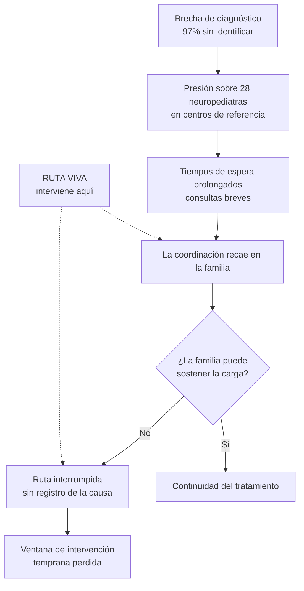

# Impacto en salud y viabilidad

Documento de sustento para la evaluación del Desafío 4 de la Hackatón en Salud INSN San Borja 2026.
Cubre los criterios de **Impacto en salud (25 %)**, **Viabilidad técnica y económica (20 %)** y
**Enfoque en el usuario (20 %)** de la rúbrica del Anexo 4.

Todas las cifras citadas provienen de fuentes públicas verificables, listadas al final. Cuando un
dato no pudo verificarse, se dice explícitamente en lugar de estimarlo.

---

## 1. El problema, dimensionado

### 1.1. La brecha de diagnóstico es el problema dominante

En el Perú, el cuello de botella del neurodesarrollo no es la capacidad de tratar: es que la mayoría
de los casos **nunca llega a ser identificada**.

| Indicador | Cifra | Fuente |
| --- | --- | --- |
| Personas autistas sin diagnóstico en el Perú | **97 %** | Mecanismo Independiente de Discapacidad, 2023, citado por Defensoría del Pueblo |
| Población autista estimada (prevalencia OMS de 62 por 10 000 hab.) | ≈ **204 818 personas** | Defensoría del Pueblo |
| Personas con TEA certificadas por el MINSA (2020) | **5 328** | Defensoría del Pueblo |
| Personas con TEA en el registro de CONADIS (2018) | **4 528** de 219 249 personas con discapacidad (2,06 %) | Rev. Soc. Peru. Med. Interna, 2024 |

La distancia entre 204 818 estimadas y 5 328 certificadas no es un problema de registro: es la
medida de cuántos niños **no están recibiendo intervención**.

El registro además crece año a año —2 248 en 2015; 2 830 en 2016; 3 709 en 2017; 4 528 en 2018—, lo
que sugiere que la demanda identificada seguirá subiendo y presionando una oferta que ya está
saturada.

### 1.2. La oferta especializada es escasa y está concentrada

La caracterización publicada más citada de la especialidad en el Perú reporta:

> «Sumando los médicos formados en el extranjero y titulados por experiencia laboral, contamos con
> **28 neuropediatras** y aproximadamente **12 neurólogos** con dedicación a la especialidad.»
> — Guillén Pinto, *Rev Neuropsiquiatr* 76(3), 2013

Ese mismo trabajo sitúa al Perú en una tasa de **0,09 neuropediatras por 100 000 habitantes**, «muy
por debajo de Chile, Uruguay, Argentina, México, Venezuela y Brasil».

> ⚠️ **Nota de honestidad metodológica.** Esta fuente es de 2013 y es la caracterización publicada
> más completa que pudimos verificar. Es probable que la cifra absoluta haya mejorado desde
> entonces. **Antes del pitch conviene actualizarla** con el Colegio Médico del Perú o el Registro
> Nacional del Personal de la Salud (INFORHUS). Presentar un dato de 2013 como si fuera actual sería
> un flanco fácil de atacar por el jurado.

La consecuencia operativa la describe la misma fuente sin rodeos:

> «Los servicios neuropediátricos están **colapsados**. La consulta se caracteriza por tiempos de
> espera **muy prolongados** y de **breve duración**. Contrariamente, estos niños requieren de mayor
> seguimiento, porque adolecen de problemas crónicos y complejos.»

### 1.3. Quién soporta el costo de esa escasez

La misma fuente caracteriza a las familias afectadas: «generalmente tienen bajo nivel de
información, mucha ansiedad y mayor nivel de pobreza».

Esa frase resume el problema que Ruta Viva ataca. Un sistema con pocos especialistas, concentrados
en centros de referencia nacional, obliga a que **la familia sea quien sostenga la coordinación**:
recordar la próxima cita, conseguir el documento faltante, costear el traslado, volver a llamar
cuando no hubo cupo. Se le transfiere una carga administrativa a quien tiene menos información,
menos tiempo y menos recursos para asumirla.

Cuando esa carga excede lo que la familia puede sostener, **la ruta se interrumpe** — y la
interrupción rara vez queda registrada como tal en ningún sistema.

### 1.4. Por qué el tiempo perdido no se recupera

La gestación y los primeros tres años de vida son el período de mayor plasticidad neuronal y
constituyen una ventana de oportunidad para el desarrollo cognitivo, social y emocional. La
evidencia indica que cuanto más temprano se interviene, mejores son los resultados a largo plazo, y
que las inversiones posteriores a los 3 años solo restauran parcialmente el desarrollo.

**Esto convierte cada mes de ruta interrumpida en una pérdida que no se recupera después.** Es el
argumento central del impacto: no se trata solo de eficiencia administrativa, sino de aprovechar una
ventana biológica que se cierra.

---

## 2. Dónde interviene Ruta Viva: mecanismo de impacto

Ruta Viva **no crea especialistas ni acorta la lista de espera**. Sería deshonesto afirmarlo. Lo que
hace es actuar sobre un punto distinto y desatendido de la cadena: **evitar que se pierda el tiempo
de atención que sí fue asignado**.

### Cadena de valor

| Eslabón | Qué cambia | Efecto esperado |
| --- | --- | --- |
| **Visibilidad** | La familia ve el estado de la ruta y el siguiente paso sin llamar por teléfono | Menos abandono por desinformación |
| **Reporte estructurado** | La dificultad se registra con tipo, contexto y disponibilidad real de la familia | La causa de la interrupción queda como dato, no como ausencia |
| **Síntesis asistida validada** | El profesional recibe el caso ordenado y decide sobre evidencia, no sobre relato disperso | Menos tiempo de consulta gastado en reconstruir el contexto |
| **Compuerta humana** | Ninguna acción ocurre sin decisión profesional registrada | Seguridad clínica y trazabilidad auditable |
| **Trazabilidad agregada** | El gestor ve dónde se rompen las rutas y por qué | Permite corregir el proceso, no solo el caso individual |

El resultado medible no es «más citas», sino **menos citas desperdiciadas y menos rutas
abandonadas silenciosamente**.

---

## 3. Indicadores de impacto

Indicadores propuestos para un piloto. La línea base debe medirse durante las primeras semanas del
piloto, porque hoy **no existe registro sistemático de interrupciones de ruta** — que es
precisamente parte del problema.

| # | Indicador | Cómo se mide | Línea base | Meta piloto |
| --- | --- | --- | --- | --- |
| 1 | **Rutas sin interrupción a 90 días** | % de casos activos sin brecha > 30 días entre paso previsto y paso realizado | A medir | ⟨definir con el INSN⟩ |
| 2 | **Tiempo entre reporte de dificultad y decisión profesional** | Mediana en horas, desde `BarrierReport.created_at` hasta `ApprovalDecision.created_at` | A medir | Reducción sostenida |
| 3 | **Barreras resueltas sin necesidad de consulta presencial** | % de dificultades cerradas por vía administrativa | A medir | ⟨definir⟩ |
| 4 | **Citas no asistidas por causa evitable** | % de inasistencias atribuidas a documento, horario o transporte | A medir | Reducción sostenida |
| 5 | **Cobertura de causa registrada** | % de interrupciones con causa identificada (hoy ≈ 0 %) | ≈ 0 % | > 80 % |

**El indicador 5 es el más honesto y el más defendible ante el jurado**: hoy el sistema no sabe por
qué se rompen las rutas. Ruta Viva convierte esa ausencia de información en un dato, y esa es una
mejora verificable desde el día uno, sin necesidad de suponer efectos clínicos.

Los indicadores 1 a 4 son hipótesis a validar en piloto, no promesas. Presentarlos como tales es
más sólido que afirmar reducciones porcentuales sin evidencia.

---

## 4. Enfoque en el usuario

### 4.1. Personas

**Rosa, 34 años — cuidadora principal.** Vive en un distrito periférico de Lima. Trabaja por horas y
cada visita al instituto le cuesta un día de ingresos más pasajes. Tiene un teléfono Android de
gama baja con datos móviles limitados. Sabe qué medicamento toma su hijo, pero no sabe qué sigue
después de la próxima cita ni a quién preguntarle. Cuando algo falla, la única vía que conoce es
volver presencialmente.
→ *Diseño:* PWA instalable, objetivos táctiles ≥ 44 px, lenguaje sin jerga clínica, estado de ruta y
siguiente paso siempre visibles en la pantalla de inicio, reporte de dificultad en pocos toques.

**Dr. Ramírez — profesional del equipo tratante.** Consulta corta y agenda saturada. Necesita
entender el caso en menos de un minuto y dejar constancia de su decisión. Desconfía —con razón— de
cualquier sistema que proponga acciones clínicas automáticas.
→ *Diseño:* aviso original y síntesis asistida lado a lado, compuerta humana explícita, cada
componente declara qué evidencia usó, decisión registrada con su justificación.

**Equipo de gestión asistencial.** Necesita saber dónde se rompe el proceso sin acceder a datos
identificables de las familias.
→ *Diseño:* indicadores agregados y grafo de trazabilidad; sin identificación de personas.

### 4.2. Decisiones de accesibilidad ya implementadas

- Objetivos táctiles de **44 px o más**, verificados a 390 × 844.
- Los estados combinan **texto, icono y color**: el significado nunca depende solo del color.
- Soporte de `prefers-reduced-motion`: la ejecución se comunica con cambios de estado y texto en
  lugar de animación.
- PWA instalable con service worker que **excluye** `/api/` y las peticiones autenticadas de la
  caché.
- Sin jerga técnica ni razonamiento interno del sistema en la vista familiar.

### 4.3. Lo que aún no está validado

**La solución no ha sido validada con usuarios reales.** El diseño se apoya en las características
descritas en la literatura citada, no en entrevistas propias. Es la limitación más importante de
cara al criterio de *Enfoque en el usuario*, cuyo nivel máximo exige una solución «validada».
Declararlo es preferible a insinuar una validación inexistente; el paso 1 del plan de implementación
la aborda.

---

## 5. Viabilidad técnica

### 5.1. El prototipo ya funciona de extremo a extremo

No es una maqueta: es un sistema ejecutable con backend, dos frontends, persistencia, autenticación,
orquestación con estado y pruebas automatizadas.

| Dimensión | Decisión | Por qué reduce el riesgo de implementación |
| --- | --- | --- |
| Backend | FastAPI + SQLite | Sin licencias. SQLite migra a PostgreSQL sin cambiar la capa de acceso (SQLAlchemy). |
| Frontends | React + Vite | Estándar del mercado; personal técnico disponible en el Perú. |
| Modelo de lenguaje | **Ollama local** (`qwen3:8b`) | Los datos del caso **no salen de la institución**. Sin costo por token. Sin dependencia de un proveedor comercial. |
| Degradación | Proveedor determinista de respaldo | Si no hay modelo ni red, **el sistema sigue funcionando**. |
| Despliegue | Contenedor único | Una sola instancia sostiene el piloto. |

### 5.2. Cumplimiento normativo: el marco ya existe

El Perú fue uno de los primeros países de la región en regular la telesalud. Ruta Viva se ubica
dentro de figuras **ya definidas en la norma**, lo que evita tener que crear un marco nuevo:

- **Ley N.° 30421**, Ley Marco de Telesalud (2016), y su reglamento **D.S. 003-2019-SA**.
- **Decreto Legislativo N.° 1490**, que fortalece la telesalud y define *Teleorientación*,
  *Telemonitoreo* e *Interoperabilidad*.

Las funciones de Ruta Viva corresponden a **teleorientación y telemonitoreo administrativo**, no a
teleconsulta ni a acto médico a distancia. Esto es deliberado: mantiene la solución dentro de un
perímetro regulatorio de baja fricción.

### 5.3. Riesgos y mitigación

| Riesgo | Mitigación en el diseño actual |
| --- | --- |
| Que la IA induzca una decisión clínica errónea | El modelo no decide: propone. La compuerta humana es una restricción arquitectónica, no una convención. El modelo no escribe en la base de datos. |
| Consulta clínica o urgente por el canal equivocado | El backend devuelve respuesta de seguridad **sin consultar al modelo**. |
| Baja conectividad en regiones | PWA instalable con caché de activos. **Pendiente:** sincronización diferida (ver plan). |
| Adopción por parte del personal asistencial | El profesional no cambia su forma de decidir; solo recibe el caso ordenado y deja constancia. |
| Dependencia de un proveedor externo | Todo el stack es código abierto y el modelo es local. |

---

## 6. Viabilidad económica

### 6.1. Estructura de costos

La arquitectura fue elegida para que el costo marginal por caso sea prácticamente nulo.

| Componente | Costo | Justificación |
| --- | --- | --- |
| Licencias de software | **S/ 0** | Todo el stack es código abierto (FastAPI, SQLite/PostgreSQL, React, Vite, Ollama). |
| Inferencia del modelo | **S/ 0 por consulta** | El modelo corre localmente. No hay costo por token ni contrato con proveedor. |
| Infraestructura de piloto | Una instancia de cómputo | Un solo servidor sostiene el piloto. Si se usa el modelo local, requiere GPU o CPU con memoria suficiente para un modelo de 8B. |
| Desarrollo del piloto | Principal partida | Integración, validación con usuarios y ajustes. |
| Operación | Soporte y mantenimiento | Sin costos de licenciamiento recurrentes. |

> ⟨COMPLETAR⟩ Cotizar la instancia de cómputo y estimar las horas de desarrollo del piloto. La
> rúbrica pide «estimaciones de costo dentro de rangos razonables y debidamente justificados»: no
> inventes cifras, pide una cotización real. **La estructura de costos ya es el argumento fuerte**
> —cero licencias, cero costo por inferencia—; solo faltan los montos.

### 6.2. Por qué esta estructura importa

Una solución de este tipo construida sobre un LLM comercial tendría **costo por consulta creciente
con la adopción**: cuanto mejor funciona, más cuesta. Al ejecutar el modelo localmente, Ruta Viva
tiene el patrón inverso — el costo es fijo y el beneficio escala. Para una institución pública con
presupuesto anual acotado, esa diferencia decide si un piloto exitoso puede sostenerse o no.

Además, el modelo local elimina la necesidad de un acuerdo de transferencia de datos de salud a un
tercero, que suele ser el trámite que bloquea proyectos de este tipo.

### 6.3. Sostenibilidad

- **Licencia MIT**: la institución puede adoptar, adaptar y mantener el código sin depender del
  equipo original ni pagar por continuidad.
- **Sin dependencia de infraestructura privada no replicable**, conforme a la declaración del
  Anexo 1.
- **Componentes reutilizables**: el motor de orquestación supervisada sirve a otros procesos
  asistenciales con compuerta humana, dentro y fuera del neurodesarrollo.

---

## 7. Ruta de implementación

| Fase | Duración estimada | Objetivo | Criterio de avance |
| --- | --- | --- | --- |
| **0. Validación con usuarios** | 4–6 semanas | Entrevistas con cuidadores y profesionales del INSN San Borja. Contrastar flujo y lenguaje. | Ajustes incorporados y documentados |
| **1. Piloto acotado** | 3 meses | Una especialidad, un grupo reducido de casos reales, con autorización institucional | Línea base medida para los 5 indicadores |
| **2. Endurecimiento** | 2–3 meses | Autenticación institucional, auditoría, respaldo, evaluación de impacto en protección de datos | Aprobación del área de seguridad de la información |
| **3. Baja conectividad** | 2 meses | Sincronización diferida para regiones con acceso intermitente | Funcionamiento verificado sin conexión continua |
| **4. Tamizaje temprano** | 3 meses | Incorporar instrumentos validados de cribado al inicio de la ruta | Instrumento validado e integrado con revisión profesional |
| **5. Interoperabilidad** | Por definir | Evaluación de HL7 FHIR para conectar con sistemas existentes | Intercambio probado en entorno de pruebas |

Las fases 3 y 4 cierran los dos ejes del enunciado del desafío que el MVP actual todavía no cubre:
**barreras geográficas** e **intervención temprana**.

---

## 8. Diferenciación

| Alternativa existente | Qué resuelve | Qué no resuelve |
| --- | --- | --- |
| Historia clínica electrónica | Registro clínico del acto asistencial | No modela la ruta ni la interrupción; no da visibilidad a la familia |
| Sistemas de citas | Agendamiento | No registra por qué la familia no llegó |
| Apps de telemedicina | Consulta a distancia | Consume tiempo del especialista, el recurso más escaso |
| Apps de recordatorios | Adherencia por notificación | No conecta con el equipo tratante ni deja trazabilidad clínica |
| Copilotos clínicos con IA | Apoyo a la decisión | Suelen situar a la IA en el camino crítico de la decisión clínica |

**Lo diferencial de Ruta Viva** es tratar la **interrupción de la ruta como el objeto de datos
central** — con causa, evidencia y decisión asociadas—, y hacer del control humano una restricción
arquitectónica verificable en lugar de una promesa. La orquestación multiagente se detiene ante la
compuerta y no puede saltarla; eso es auditable en el código, no solo en la documentación.

Es una propuesta de **IA responsable en salud pública**: demuestra que se puede incorporar
orquestación con modelos de lenguaje en un proceso asistencial real **sin ceder ninguna decisión
clínica al modelo**.

---

## 9. Limitaciones declaradas

Enunciarlas fortalece la propuesta ante un jurado técnico:

1. Todos los datos del prototipo son **sintéticos**; no se ha operado con información real.
2. **No hay validación con usuarios finales** (fase 0 del plan).
3. La cifra de neuropediatras proviene de **2013** y debe actualizarse.
4. Los indicadores 1 a 4 son **hipótesis a validar**, no efectos demostrados.
5. El MVP **no cubre tamizaje** ni funcionamiento sin conexión (fases 3 y 4).
6. El uso real exige autorización institucional, gobernanza clínica, interoperabilidad y evaluación
   de impacto en protección de datos personales.

---

## 10. Fuentes

1. Defensoría del Pueblo del Perú. *Defensoría del Pueblo advierte que las personas autistas,
   principalmente mujeres, enfrentan barreras para acceder al diagnóstico temprano.*
   https://www.defensoria.gob.pe/defensoria-del-pueblo-advierte-que-las-personas-autistas-principalmente-mujeres-enfrentan-barreras-para-acceder-al-diagnostico-temprano/
2. Guillén Pinto, D. *Situación de la Neuropediatría en el Perú.* Revista de Neuro-Psiquiatría,
   76(3), 2013. Universidad Peruana Cayetano Heredia.
   https://revistas.upch.edu.pe/index.php/RNP/article/download/1178/1210/2261
3. *Trastorno del espectro autista (TEA): un problema importante por atender.* Revista de la
   Sociedad Peruana de Medicina Interna, 2024.
   http://www.scielo.org.pe/scielo.php?script=sci_arttext&pid=S1727-558X2024000100017
4. Infobae Perú. *El 97 % de personas autistas en el Perú no estaría diagnosticada por falta de
   acceso a servicios de salud*, 2 de abril de 2024.
   https://www.infobae.com/peru/2024/04/02/el-97-de-personas-autistas-en-peru-no-estarian-diagnosticadas-por-falta-de-acceso-a-servicios-de-salud/
5. *Breve recuento histórico del autismo en Perú.* Revista Peruana de Medicina Experimental y Salud
   Pública, 41(2), 2024. https://www.scielosp.org/article/rpmesp/2024.v41n2/214-219/
6. Congreso de la República del Perú. *Ley N.° 30421, Ley Marco de Telesalud* (2016), reglamento
   D.S. 003-2019-SA y Decreto Legislativo N.° 1490.
   https://www.gob.pe/institucion/congreso-de-la-republica/normas-legales/192482-30421
7. *Avances en el desarrollo infantil temprano: desde neuronas hasta programas a gran escala.*
   Boletín Médico del Hospital Infantil de México, 2017.
   https://www.scielo.org.mx/scielo.php?script=sci_arttext&pid=S1665-11462017000200086

> **Antes del pitch:** verifica que cada enlace siga activo y considera actualizar la fuente 2 con
> datos vigentes del Colegio Médico del Perú o INFORHUS.
